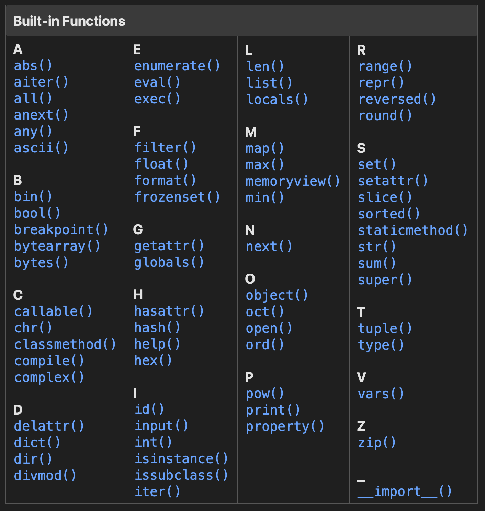

# Referências Internas (built-in)

## Built-in functions:
- https://docs.python.org/3/library/functions.html

## Built-in constants:
- https://docs.python.org/3/library/constants.html
    - `False`
    - `True`
    - `None`
    - `NotImplemented`
    - `Ellipsis`
    - `__debug__`
    - From "site" module:
        - The site module (which is imported automatically during startup, except if the -S command-line option is given) adds several constants to the built-in namespace. They are useful for the interactive interpreter shell and should not be used in programs.
        - `quit(code=None)`
        - `exit(code=None)`
        - `copyright`
        - `credits`
        - `license`

## Built-in types:
- https://docs.python.org/3/library/stdtypes.html
    - int
    - float
    - complex
    - fractions.Fraction
    - decimal.Decimal
    - bool
    - list
    - tuple
    - set
    - frozenset
    - dict
    - defaultdict
    - str
    - range
    - bytes
    - bytearray
    - type
        - NoneType
    - Type of some detail in the Python Language:
        - class
        - instance
        - Exception
        - Iterator
        - Generators
