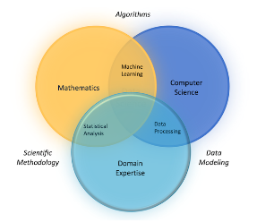

# Visão geral
- https://numpy.org/
- NumPy is the fundamental package for scientific computing in Python. It is a Python library that provides a multidimensional array object, various derived objects (such as masked arrays and matrices), and an assortment of routines for fast operations on arrays, including mathematical, logical, shape manipulation, sorting, selecting, I/O, discrete Fourier transforms, basic linear algebra, basic statistical operations, random simulation and much more.
- Powerful N-dimensional arrays
    - Fast and versatile, the NumPy vectorization, indexing, and broadcasting concepts are the de-facto standards of array computing today.
- Numerical computing tools
    - NumPy offers comprehensive mathematical functions, random number generators, linear algebra routines, Fourier transforms, and more. 
- Performant
    - The core of NumPy is well-optimized C code. Enjoy the flexibility of Python with the speed of compiled code.
    - NumPy brings the computational power of languages like C and Fortran to Python, a language much easier to learn and use. With this power comes simplicity: a solution in NumPy is often clear and elegant.
- Executa operações matemáticas complexas com objetos do tipo array, de forma eficiente e otimizada.
- Trabalha com arrays multidimensionais, além de seus objetos derivados: matrizes, sequências, ...
- Possui grande variedade de operações com arrays, incluindo operações lógicas, manipulações de formato, ordenação e seleção, ferramentas de estatística e cálculo.

## Ecosystem

### Quantum Computing
- QuTiP
- PyQuil
- Qiskit
- PennyLane

### Statistical Computing
- Pandas
- statsmodels
- Xarray
- Seaborn

### Signal Processing
- SciPy
- PyWavelets
- python-control
- HyperSpy

### Image Processing
- Scikit-image
- OpenCV
- Mahotas

### Graphs and Networks
- NetworkX
- graph-tool
- igraph
- PyGSP

### Astronomy
- AstroPy
- SunPy
- SpacePy

### Cognitive Psychology
- PsychoPy

### Bioinformatics
- BioPython
- Scikit-Bio
- PyEnsembl
- ETE

### Bayesian Inference
- PyStan
- PyMC3
- ArviZ
- emcee

### Mathematical Analysis
- SciPy
- SymPy
- cvxpy
- FEniCS

### Chemistry
- Cantera
- MDAnalysis
- RDKit
- PyBaMM

### Geoscience
- Pangeo
- Simpeg
- ObsPy
- Fatiando a Terra

### Geographic Processing
- Shapely
- GeoPandas
- Folium

### Architecture & Engineering
- COMPAS
- City Energy Analyst
- Sverchok

### Data Science
- `Extract, transform and load data` 
    - Pandas,
    - Intake,
    - PyJanitor
- `Exploratory analysis`
    - Jupyter,
    - Seaborn,
    - Matplotlib,
    - Altair
- `Model and evaluate`
    - scikit-learn, 
    - statsmodels,
    - PyMC3, 
    - spaCy
- `Report in a dashboard`
    - Dash,
    - Panel,
    - Voila

# Domínios de Estudo/Análise

- Fonte: site Numpy, consultado em 10/05/2024

- Dados tabelados
- Somar dados
- Calcular médias
- Ferramenta Numpy
    - objetos do tipo array
    - rapidez
    - eficiência no uso da memória
- Carregar dados
    - 
