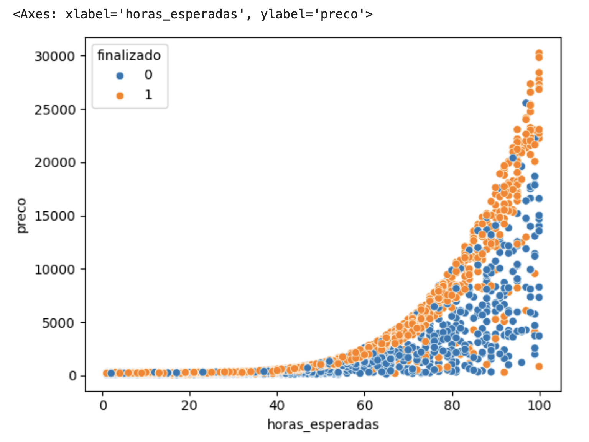
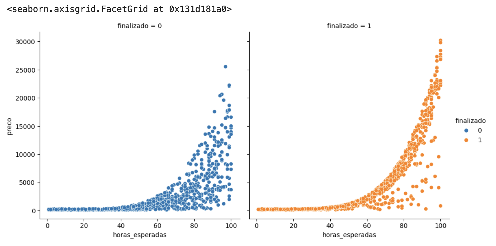

# Avaliação do Algoritmo de Classificação

## Seleção e treino
  
```python
import pandas as pd 
uri= 'https://gist.githubusercontent.com/guilhermesilveira/1b7d5475863c15f484ac495bd70975cf/raw/16aff7a0aee67e7c100a2a48b676a2d2d142f646/projects.csv'
dados = pd.read_csv(uri)
# alteração do nome das colunas
mapa_alteracao_titulos = {
    "expected_hours": "horas_esperadas",
    "price": "preco",
    "unfinished": "nao_finalizado"
}
dados = dados.rename(columns=mapa_alteracao_titulos)
# mudança do conteúdo da coluna não_finalizado em nova coluna
troca = {
0: 1,
1: 0
}
dados["finalizado"] = dados.nao_finalizado.map(troca)
# Separação dos dados de feature e dos dados de classe
x = dados[["horas_esperadas", "preco"]]
y = dados["finalizado"]
# Avaliar os dados de treino e de teste
print(x.shape)
print(y.shape)
x.value_counts()
y.value_counts()
# Decisão de treinar com 75% dos dados e testar com 25% dos dados
treino_x = x[:75]
treino_y = y[:75]
teste_x = x[75:]
teste_y = y[75:]
# Treino
from sklearn.svm import LinearSVC
modelo = LinearSVC()
modelo.fit(treino_x, treino_y)
```

## Teste e identificação da acurácia
```python
previsoes = modelo.predict(teste_x)
from sklearn.metrics import accuracy_score
acuracia = accuracy_score(teste_y, previsoes) * 100
print("A acurácia de %.2f%%" % acuracia)
```  

## Reteste, com split de sklearn, e reidentificação da acurácia
```python
# separação dos dados com split, random_state e com stratify
from sklearn.model_selection import train_test_split
SEED = 20
treino_x, teste_x, treino_y, teste_y = train_test_split(
    x, 
    y,
    random_state = SEED, 
    test_size = 0.25,
    stratify = y)
# retreino
from sklearn.svm import LinearSVC
modelo = LinearSVC()
modelo.fit(treino_x, treino_y)
# reteste e identificação da acurácia
previsoes = modelo.predict(teste_x)
from sklearn.metrics import accuracy_score
acuracia = accuracy_score(teste_y, previsoes) * 100
print("A acurácia de %.2f%%" % acuracia)
```  

## Plotar e avaliar a dispersão dos dados.
```python
import seaborn as sns
sns.scatterplot(x="horas_esperadas", y="preco", data=dados)
```


## Avaliar graficamente a dispersão dos dados com cores para valores da coluna "finalizado"
```python
sns.scatterplot(x="horas_esperadas", y="preco", hue="finalizado", data=dados)
```

- Esta é a realidade dos dados de Y (classificação final).
    - Conclui-se que o melhor algorítmo deve ter este formado de curva ascendente.
## Avaliar graficamente a dispersão dos dados com gráficos separados para valores da coluna "finalizado" e com cores para a mesma coluna
```python
sns.relplot(x="horas_esperadas", y="preco", col="finalizado", hue="finalizado",data=dados)
```

- Esta é a realidade dos dados de Y (classificação final).
    - Percebe-se claramente que o melhor algorítmo deve ter este formado de curva ascendente.
    - O gráfico laranja indica qual a curva que deve ser buscada. 
    - Valores muito próximos desta curva, devem ser considerados como "Finalizados".
    - Valores distantes desta curva devem ser considerados como "Não-Finalizados".

## Criação de algoritmo de baseline para comparação de algoritmos
```python
# acurácia do algoritmo atual, com previsões atuais
acuracia = accuracy_score(teste_y, previsoes) * 100
print("A acurácia atual: %.2f%%" % acuracia)
# baseline de comparação
import numpy as np
previsoes_base_line = np.ones(540)
# acurácia da baseline
acuracia_de_baseline = accuracy_score(teste_y, previsoes_base_line) * 100
print("A acurácia de baseline: %.2f%%" % acuracia_de_baseline)
```
## Apresentação gráfica da curva de decisão do algorítmo
```python

x_min = teste_x.horas_esperadas.min()
x_max = teste_x.horas_esperadas.max()
y_min = teste_x.preco.min()
y_max = teste_x.preco.max()

pixels = 100
eixo_x = np.arange(x_min, x_max, (x_max - x_min) / pixels)
eixo_y = np.arange(y_min, y_max, (y_max - y_min) / pixels)

xx, yy = np.meshgrid(eixo_x, eixo_y)
pontos = np.c_[xx.ravel(), yy.ravel()]
z = modelo.predict(pontos)
z = z.reshape(xx.shape)
# plotagem
import matplotlib.pyplot as plt
plt.contourf(xx, yy, z, alpha=0.3)
plt.scatter(teste_x_horas_esperadas, teste_x_preco, c=teste_y, s=1)
````
