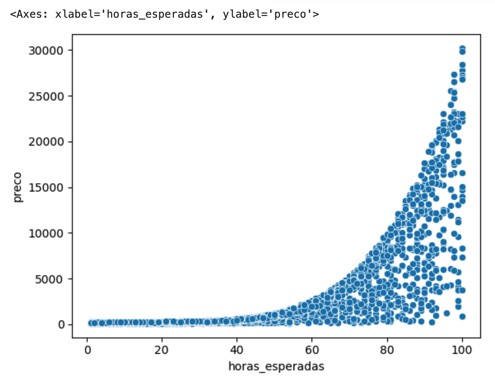

# Otimização na Classificação

## Etapas
1. Extração de dados para treino e para testes
   
```python
import pandas as pd 
uri= 'https://gist.githubusercontent.com/guilhermesilveira/1b7d5475863c15f484ac495bd70975cf/raw/16aff7a0aee67e7c100a2a48b676a2d2d142f646/projects.csv'
dados = pd.read_csv(uri)
mapa_alteracao_titulos = {
    "expected_hours": "horas_esperadas",
    "price": "preco",
    "unfinished": "nao_finalizado"
}
dados = dados.rename(columns=mapa_alteracao_titulos)
troca = {
0: 1,
1: 0
}
dados["finalizado"] = dados.nao_finalizado.map(troca)
x = dados[["horas_esperadas", "preco"]]
y = dados["finalizado"]
```
## Ver shape dos dados
```python  
print(x.shape)
print(y.shape)
```

## Decisão de treinar com 75% dos dados e testar com 25% dos dados
```python
treino_x = x[:75]
treino_y = y[:75]
teste_x = x[75:]
teste_y = y[75:]
```  

## Treino
```python
from sklearn.svm import LinearSVC
modelo = LinearSVC()
modelo.fit(treino_x, treino_y)
```

## Teste e identificação da acurácia
```python
previsoes = modelo.predict(teste_x)
from sklearn.metrics import accuracy_score
acuracia = accuracy_score(teste_y, previsoes) * 100
print("A acurácia de %.2f%%" % acuracia)
```  

## Teste e identificação da acurácia com split de sklearn
```python
x = dados[["homepage", "como_funciona", "contato"]]
y = dados["comprado"]
from sklearn.model_selection import train_test_split
SEED = 20
treino_x, teste_x, treino_y, teste_y = train_test_split(x, y, random_state = SEED, test_size = 0.25)
from sklearn.svm import LinearSVC
modelo = LinearSVC()
modelo.fit(treino_x, treino_y)
previsoes = modelo.predict(teste_x)
from sklearn.metrics import accuracy_score
acuracia = accuracy_score(teste_y, previsoes) * 100
print("A acurácia de %.2f%%" % acuracia)
```  

2. Plotar a dispersão dos dados.
```python
import seaborn as sns
sns.scatterplot(x="horas_esperadas", y="preco", data=dados)
```


### Estratificação de dados sem biblioteca biblioteca train_test_split
- **Pergunta:**
    - Dados: https://gist.github.com/guilhermesilveira/73cc6976569c41a338bbec78757d6756
    - Se uma pessoa ter as features:
        - Residir em certo local
        - E ter covid
        - Ela deve falecer? Ou deve se recuperar?
    - Só consigo responder e treinar o sistema de Inteligência Artificial se eu:
        - Organizar a disposição dos dados.
        - Separar os indivíduos por linha.
        - Dar maior significado às colunas, mediante organização visual.
#### Organização dos Dados
```python
from pathlib import Path
import pandas as pd

file_path = Path('src/python-coding/notebook/dados.csv')
file_path_absolute = file_path.absolute()
dados = pd.read_csv(file_path_absolute)
mapa_de_alteracao_nomes = {
    "Province/State": "local",
    "Confirmed": "confirmacoes_de_covid",
    "Deaths": "obitos_por_causa_da_covid",
    "Recovered": "recuperacoes_depois_da_covid"
}
dados = dados.rename(columns = mapa_de_alteracao_nomes)
# dados.head()
dados = dados[['local', 'confirmacoes_de_covid', 'obitos_por_causa_da_covid', 'recuperacoes_depois_da_covid']]
print(dados.head())
# modelo de features
# modelo_features_de_item = [feature1, feature2, ]

```  
#### Identificação do modelo de fetures e de classes
- todo

#### Estratificação separada dos itens como lista individualizada de features
- O Modelo não predisa ser uma lista de items separados.
- O modelo pode ser um NumpY Array, sendo que cada "coluna" é uma feature. 
- Use dados.shape() para avaliar a dimensão dos dados de treino.

#### Estratificação separada dos itens como uma opção de classe

#### Escolha da quantidade de itens de treinos e de itens de testes.
- Não usar dados de testes no conjunto dos dados de treinos.

#### Executar treinamentos e testes, avaliando a escolha da quantificação de dados. 


